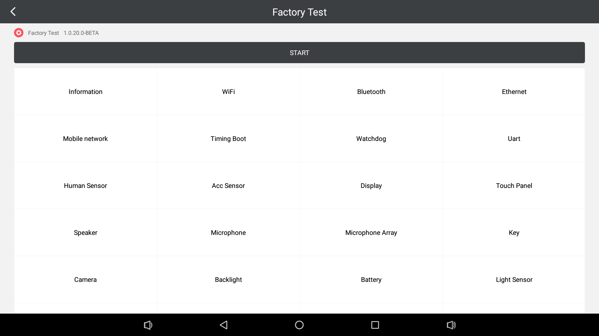
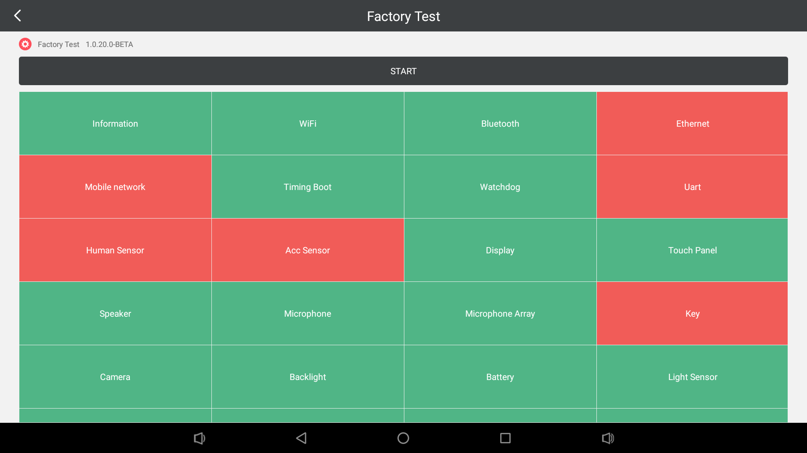
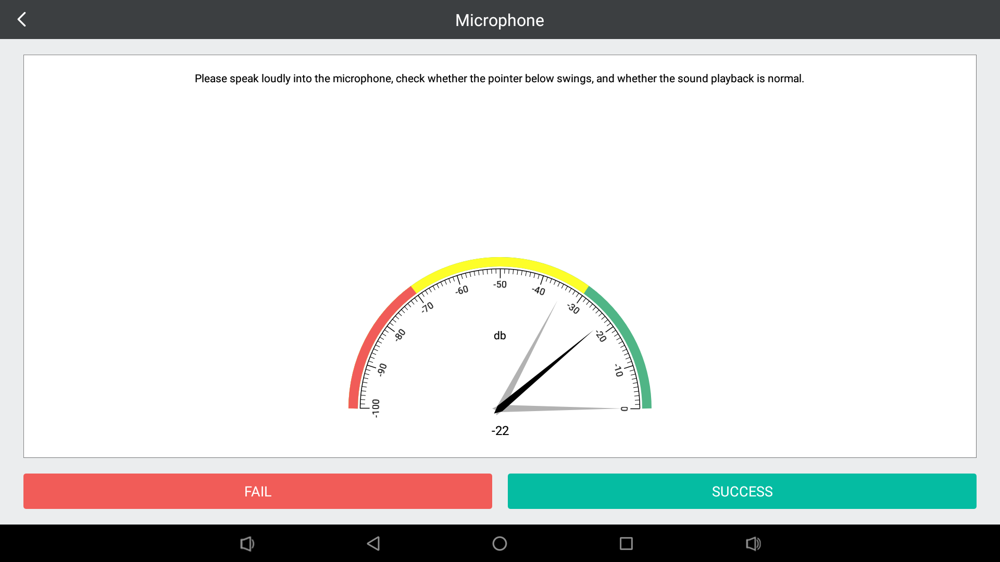
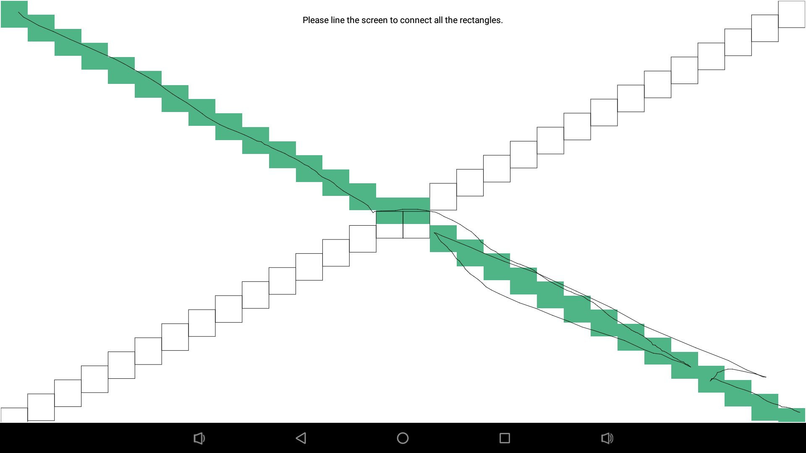

# Factory Test

[](https://www.pgyer.com/D838)  

FactoryTest is used for manufacturing tests on Android devices. Includes: WiFi, Bluetooth, Ethernet, Mobile Network and more tests. Based on the function combination supported by different products, some items also support parameter configuration, which can be fully adapted to various products. After the test is complete, test results can be exported as files for analysis.

## Preview
  
  
  
  

## Configuration
In order to flexibly adapt to various products, the APP supports configuration files to configure function combinations and test parameters. The configuration method is as follows:

1. Create a configuration file (factory_test_config.json).
2. Edit a configuration file by referring to the following text:
```json
[
  {"key": "info", "param": ""},
  {"key": "wifi", "param": ""},
  {"key": "bt", "param": ""},
  {"key": "eth", "param": ""},
  {"key": "mobile", "param": ""},
  {"key": "timingboot", "param": ""},
  {"key": "watchdog", "param": ""},
  {"key": "uart", "param": "[{'device':'/dev/ttyS1', 'baud': 9600, 'send': '7A7A', 'receive': '7A7A', 'state': 0}, {'device':'/dev/ttyS3', 'baud': 9600, 'send': '7A7A', 'receive': '7A7A', 'state': 0}, {'device':'/dev/ttyS4', 'baud': 9600, 'send': '7A7A', 'receive': '7A7A', 'state': 0}]"},
  {"key": "human", "param": ""},
  {"key": "acc", "param": ""},
  {"key": "display", "param": ""},
  {"key": "touch", "param": ""},
  {"key": "spk", "param": ""},
  {"key": "mic", "param": ""},
  {"key": "micarray", "param": "{'card':0, 'device': 1, 'channels': 4, 'rate':16000, 'bits':16, 'period_size':1024, 'period_cnt':3, 'play_channel':0}"},
  {"key": "key", "param": "[{'name':'BACK', 'code': 4, 'state': 0}, {'name':'MENU', 'code': 82, 'state': 0}, {'name':'MUTE', 'code': 164, 'state': 0}, {'name':'VOL+', 'code': 24, 'state': 0}, {'name':'VOL-', 'code': 25, 'state': 0}]"},
  {"key": "camera", "param": ""},
  {"key": "backlight", "param": ""},
  {"key": "battery", "param": ""},
  {"key": "light", "param": ""},
  {"key": "temp", "param": ""},
  {"key": "usb", "param": ""},
  {"key": "sd", "param": ""},
  {"key": "gpio", "param": ""},
  {"key": "wiegand", "param": "{'write': {'format': 26, 'value': 7825015}, 'read': {'format': 26, 'value': 0}}"},
  {"key": "nd01", "param": "{'i2c': 1, 'calibrate': true}"},
  {"key": "pwm", "param": "[{'name': 'LED', 'pwm': 0, 'period': 10000, 'duty': 1000, 'state': 0}, {'name': 'Motor', 'pwm': 1, 'period': 10000, 'duty': 1000, 'state': 0}, {'name': 'Buzzer', 'pwm': 2, 'period': 10000, 'duty': 1000, 'state': 0}]"},
  {"key": "led", "param": "[{'name': 'RED', 'device': 'led_r', 'brightness': 1000, 'state': 0}, {'name': 'GREEN', 'device': 'led_g', 'brightness': 1000, 'state': 0}, {'name': 'BLUE', 'device': 'led_b', 'brightness': 1000, 'state': 0}]"}
]
```
3. Add the configuration file to /vendor directory to complete the configuration.

### Configuration Format
The configuration file consists of a Json array containing several Json items, each in the following format:
```json
{"key": "key", "param": "paramter"}
```
- **key**: keyword (**note**: Must be supported for keyword.)
- **param**: parameter (**note** : For some test items, parameters are required. For non-parameter items, empty string is used.)

#### KEY
- **info**: device information test
- **wifi**: wifi test
- **bt**: bluetooth test
- **eth**: ethernet test
- **mobile**: mobile network (3G/4G/5G) test
- **timingboot**: timing boot test
- **watchdog**: watchdog test
- **uart**: uart test
- **human**: proximity sensor test
- **acc**: accel sensor
- **display**: lcd test
- **touch**: touch panel test
- **spk**: speaker test
- **mic**: microphone test
- **micarray**: microphone array test
- **key**: key test
- **camera**: camera test
- **backlight**: lcd backlight test
- **battery**: battery test
- **light**: light sensor test
- **temp**: temperature and humidity sensor test
- **usb**: usb test
- **sd**: sdcard test
- **gpio**: gpio test
- **wiegand**: wiegand interface test
- **nd01**: range sensor test
- **pwm**: pwm device test
- **led**: led test

#### UART Parameters
```json
[{'device':'/dev/ttyS1', 'baud': 9600, 'send': '7A7A', 'receive': '7A7A', 'state': 0}, {'device':'/dev/ttyS3', 'baud': 9600, 'send': '7A7A', 'receive': '7A7A', 'state': 0}, {'device':'/dev/ttyS4', 'baud': 9600, 'send': '7A7A', 'receive': '7A7A', 'state': 0}]
```
- **device**: serial port device file path
- **baud**: baud rate
- **send**: hex data sent to serial TX
- **receive**: hex data that serial port RX should receive (**note**:  The test fails if the specified data is not received within the timeout period.)
- **state**: status (default: 0)

#### Microphone Array Parameters
```json
{'card':0, 'device': 1, 'channels': 4, 'rate':16000, 'bits':16, 'period_size':1024, 'period_cnt':3, 'play_channel':0}
```
- **card**: sound card id
- **device**: device id
- **channels**: total number of recording channels (Number of channels to record data.)
- **rate**: sampling rate (8000, 16000, 44100, etc.)
- **bits**: pcm data format (8bit, 16bit, 24bit, 32bit)
- **period_size**: number of frames sampled in a period
- **period_cnt**: number of periods
- **play_channel**: playback channel (Which channel data is used for playback.)

#### KEY Parameters
```json
[{'name':'BACK', 'code': 4, 'state': 0}, {'name':'MENU', 'code': 82, 'state': 0}, {'name':'MUTE', 'code': 164, 'state': 0}, {'name':'VOL+', 'code': 24, 'state': 0}, {'name':'VOL-', 'code': 25, 'state': 0}]
```
- **name**: key name
- **code**: key code
- **state**: status (default: 0)

#### Wiegand Parameters
```json
{'write': {'format': 26, 'value': 7825015}, 'read': {'format': 26, 'value': 0}}
```
- **write**: wiegand write.
- **read**: wiegand read.
- **format**: format (26: wiegand 26, 34: wiegand 34).
- **value**: data to be written to the wiegand peripherals (**note** : In the Wiegand read configuration this item is set to 0 by default).

#### ND01 Parameters
```json
{'i2c': 1, 'calibrate': true}
```
- **i2c**: i2c bus.
- **calibrate**: whether calibration is required (true: calibration is required, false: no calibration is required).

#### PWM Parameters
```json
[{'name': 'LED', 'pwm': 0, 'period': 10000, 'duty': 1000, 'state': 0}, {'name': 'Motor', 'pwm': 1, 'period': 10000, 'duty': 1000, 'state': 0}, {'name': 'Buzzer', 'pwm': 2, 'period': 10000, 'duty': 1000, 'state': 0}]
```
- **name**: device name (Indicates the best device name, for example: LED, Motor, Buzzer, etc.)
- **pwm**: pwm id (Which channel pwm of the cpu.)
- **period**: pwm period
- **duty**: duty cycle (The duty cycle expected to output when tested.)
- **state**: status (default: 0)

#### LED Parameters
```json
[{'name': 'RED', 'device': 'led_r', 'brightness': 1000, 'state': 0}, {'name': 'GREEN', 'device': 'led_g', 'brightness': 1000, 'state': 0}, {'name': 'BLUE', 'device': 'led_b', 'brightness': 1000, 'state': 0}]
```
- **name**: led name (for example: red, green, blue)
- **device**: device name in /sys/class/leds/
- **brightness**: brightness value of led after lighting (duty cycle of pwm).
- **state**: status (default: 0)

## Test Results
After completion of all tests will export test results to a local file (sdcard/factorytest/result.txt), the content is as follows:
```
Test result (2015-04-30 02:18:26)

Information: SUCCESS
WiFi: SUCCESS
Bluetooth: SUCCESS
Ethernet: FAIL
Mobile network: FAIL
Timing Boot: SUCCESS
Watchdog: SUCCESS
Uart: FAIL
Human Sensor: FAIL
Acc Sensor: FAIL
Display: SUCCESS
Touch Panel: SUCCESS
Speaker: SUCCESS
Microphone: SUCCESS
Microphone Array: SUCCESS
Key: FAIL
Camera: SUCCESS
Backlight: SUCCESS
Battery: SUCCESS
Light Sensor: SUCCESS
Temperature-Humidity Sensor: SUCCESS
USB: SUCCESS
sdcard: SUCCESS
GPIO: SUCCESS
Wiegand: SUCCESS
Distance Sensor: FAIL
PWM: SUCCESS
LED: SUCCESS

Total 28 items
Pass 21 items
Fail 7 items
Ignore 0 items
```

## Developed By
- ayst.shen@foxmail.com

## License
```
Copyright 2019 Bob Shen.

Licensed under the Apache License, Version 2.0 (the "License");
you may not use this file except in compliance with the License.
You may obtain a copy of the License at

http://www.apache.org/licenses/LICENSE-2.0

Unless required by applicable law or agreed to in writing, software
distributed under the License is distributed on an "AS IS" BASIS,
WITHOUT WARRANTIES OR CONDITIONS OF ANY KIND, either express or implied.
See the License for the specific language governing permissions and
limitations under the License.
```
